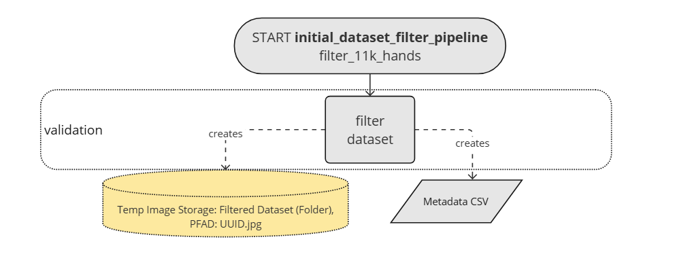
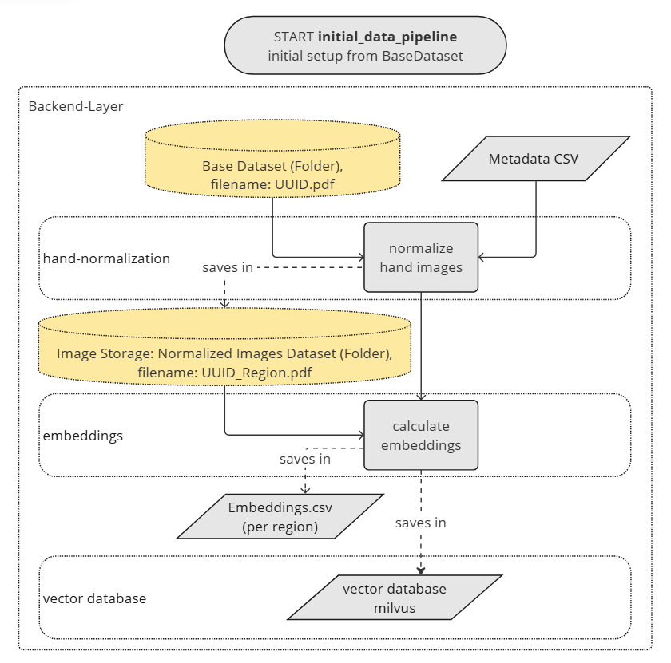
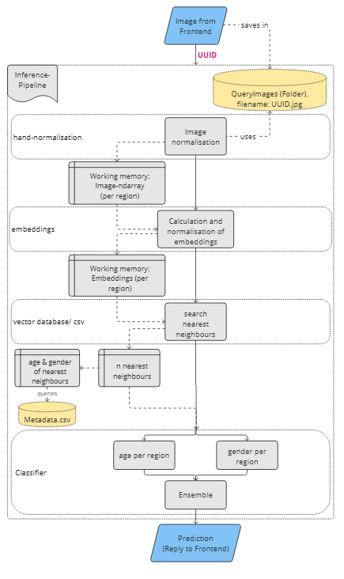
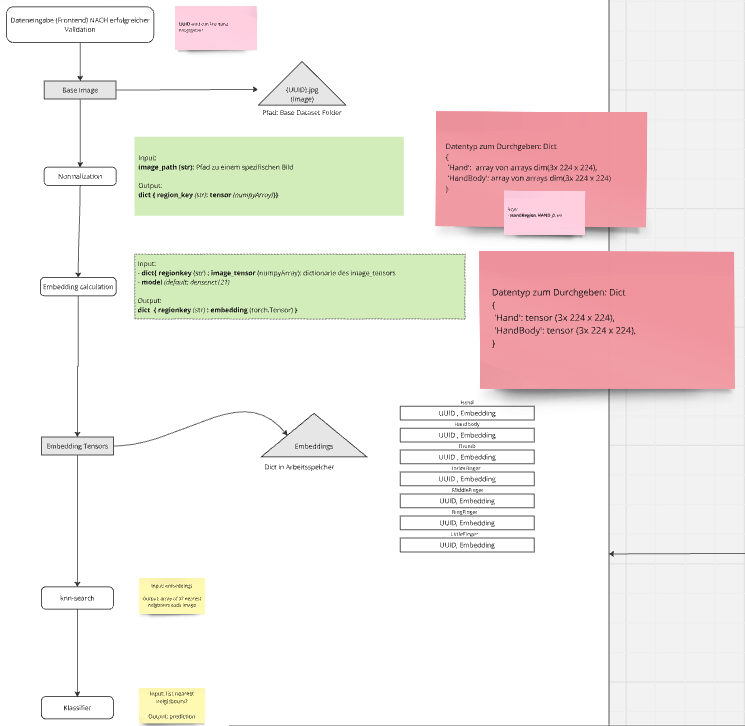
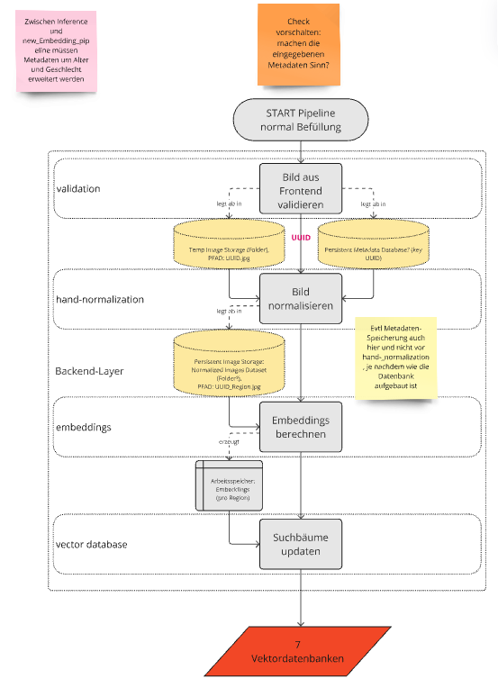
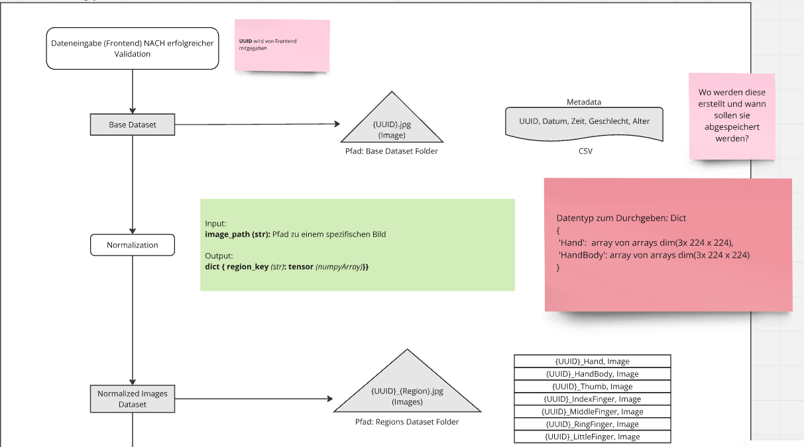
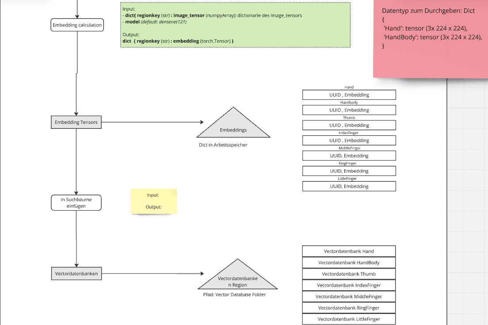

# Pipelines

TODO: Add information on pipelines.
Info: Pipelines will get updated once the vector database gets introduced. Until then, see Miro Board for current information.

## Table of contents

- [Pipelines](#pipelines)
  - [Table of contents](#table-of-contents)
  - [Initial Dataset Filter Pipeline](#initial-dataset-filter-pipeline)
    - [Use the initial dataset filter pipeline](#use-the-initial-dataset-filter-pipeline)
  - [Initial Data Pipeline](#initial-data-pipeline)
    - [Use the initial data pipeline](#use-the-initial-data-pipeline)
  - [Inference Pipeline](#inference-pipeline)
    - [Use the inference pipeline](#use-the-inference-pipeline)
  - [Add new Embeddings Pipeline](#add-new-embeddings-pipeline)
    - [Use the add new Embeddings pipeline](#use-the-add-new-embeddings-pipeline)
  - [Utils for Pipelines](#utils-for-pipelines)
    - [csv\_utils](#csv_utils)
    - [data\_utils](#data_utils)
    - [region\_utils](#region_utils)
    - [datasets](#datasets)
  - [Distance Caculation](#distance-caculation)

## Initial Dataset Filter Pipeline

This pipeline-step is optional and can be used to

- filter pre-existing datasets via the project's validation criteria
- generate uuids for the validated images and save them with the dataname-schema {UUID}.jpg
- save the corresponding metadata into a csv
  - takes metadata in csv-format (implemented for filtering 11k-dataset, will need adjustments for other datasets or formats)
  - csv-header of result-csv:
  `["uuid", "old_id", "age", "gender", "skinColor", "accessories", "aspectOfHand", "imageName", "irregularities"]`

### Use the initial dataset filter pipeline

Before using the pipeline, make sure all the necessary paths for loading and saving the images and other data in `backend/manage.py` are updated/ correct:

- `folder_path_initial_dataset`: path to the dataset folder that should be filtered (e.g. 11k)
- `initial_csv_path` = full path to original metadata csv-file, e.g. "C:\Documents\HandScanAI\HandInfo.csv"
- `filtered_dataset_path` = path to folder where the filtered images should be saved, e.g. "NewDataset" or "BaseDataset"
- `new_csv_path` = full path to csv-file where metadata for filtered images should be saved

Then, the pipeline can be run from the `/backend`-folder via console:
`python manage.py initial_dataset_filter`
(Works for Windows. For other ways to use `manage.py` by running python from the console, see `README` under `/backend` and adjust command as necessary).

## Initial Data Pipeline

This pipeline (`initial_data_pipeline.py`) is used to provide the initial chunk of data for the databases when they are built from the ground up OR is used when a whole new dataset is added to existing databases. Initially, it is used to filter and process relevant images from the 11k dataset.

The following diagrams show the concept of the pipeline as of 10.12.24 with temporary saving images and metadata locally.
TODO: Update when databases get introduced.

TODO: Add dataflow and data types of pipeline

### Use the initial data pipeline

Before using the pipeline, make sure all the necessary paths for loading and saving the images and other data are updated/ correct (tbd better documentation of what that all is).

Then, the pipeline can be run from the `/backend`-folder via console:
`python manage.py initial_data_pipeline`. (Windows. For other ways to use `manage.py` by running python from the console, see `README` under `/backend`).

## Inference Pipeline

This pipeline (inference_pipeline.py) is used to predict the age and gender of an image. It normalises the image, calculates the embedding, performs a knn-search and determines the age and size of the nearest neighbours via metadata classification

The following diagram shows the flow of the pipeline:

The following diagram shows the inputs and outputs of the individual steps:

TODO: Add knn-search and classification to diagram

### Use the inference pipeline

make sure that the folders are created as described here ["Setup"](../README.md#setup)

with connection backend and frontend:
the pipeline is called up by the frontend via the graphql interface when the ‘Analyse starten’ button has been pressed. The UUID of the image just taken must be transferred to the pipeline.
graphql function get_scan_result()

For Testing:
The pipeline can be executed via the test_inference_pipeline.py from the `/backend` folder via the console:
pytest -s tests/pipelines/test_inference_pipeline.py

## Add new Embeddings Pipeline

This pipeline (add_new_embeddings_pipeline.py) is used after checking the metadata for age and gender to add the embeddings of a new image to the vectortrees. It also saves the images of each region.

The following diagram shows the flow of the pipeline:

The following diagram shows the inputs and outputs of the individual steps:

TODO: Add integration of embeddings to vektortree

### Use the add new Embeddings pipeline

Make sure in the method get_image_path() is the correct path to the image_folder and the 'output_folder_path_base' is correct.

The pipeline can be executed via the test_add_new_embeddings_pipeline.py from the `/backend` folder via the console:
pytest -s tests/pipelines/test_add_new_embeddings_pipeline.py

later:
After a check of the metadata (manually by a person or with a check-script), it is triggert by the fronted and the uuid is transferred.

## Utils for Pipelines

### csv_utils

### data_utils

### region_utils

### datasets

## Distance Caculation
