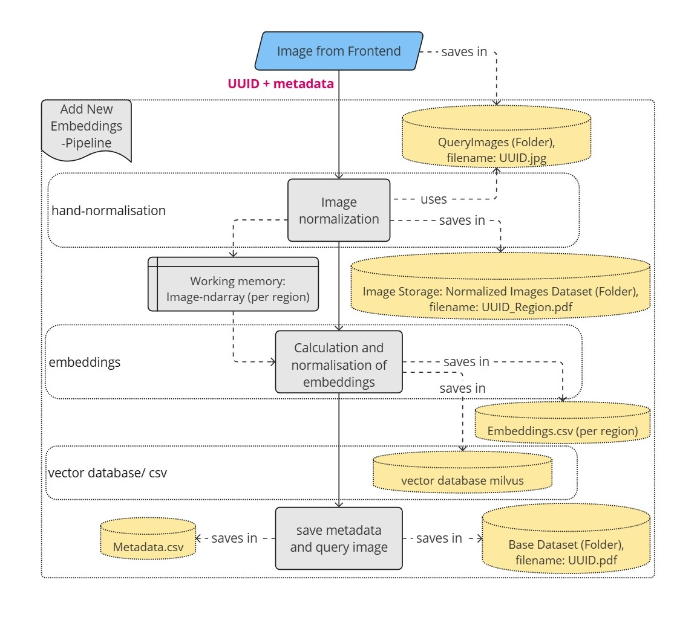
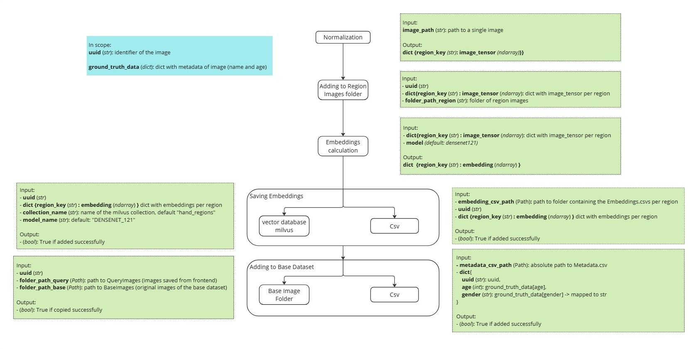

# Pipelines

## Table of contents

- [Pipelines](#pipelines)
  - [Table of contents](#table-of-contents)
  - [Overview](#overview)
  - [Initial Dataset Filter Pipeline](#initial-dataset-filter-pipeline)
    - [Use the initial dataset filter pipeline](#use-the-initial-dataset-filter-pipeline)
  - [Initial Data Pipeline](#initial-data-pipeline)
    - [Use the initial data pipeline](#use-the-initial-data-pipeline)
  - [Inference Pipeline](#inference-pipeline)
    - [Use the inference pipeline](#use-the-inference-pipeline)
  - [Add new Embeddings Pipeline](#add-new-embeddings-pipeline)
    - [Use the add new Embeddings pipeline](#use-the-add-new-embeddings-pipeline)
  - [Utils for Pipelines](#utils-for-pipelines)
    - [data\_utils](#data_utils)
    - [datasets](#datasets)
  - [Distance/ Similarity Caculation](#distance-similarity-caculation)

## Overview

The pipeline-modules described here string several functionalities of other modules together and form the main workflow of the backend.

There are four different pipelines, used in different situations and called from different places in the app:

- **Initial Dataset Filter Pipeline**: Filters the 11K-Dataset for usable pictures.
  - Gets called only to prepare the dataset for the application.
  - Gets called from the `manage.py` via `initial_dataset_filter`.
  - For further information, see [Initial Dataset Filter Pipeline](#initial-dataset-filter-pipeline).
- **Initial Data Pipeline**: Enables the normalization, calculation of embeddings and storing of the resulting images and information for large bulk of images (e.g. for the result of the Initial Dataset Filter Pipeline).
  - Gets called to set up the necessary data for the application on a new device or to save additional data for many images at once.
  - Gets called from the `manage.py` via `setup_new_project_data` or `bulk_import_calculations`, depending on the usecase.
  - For further information, see [Initial Data Pipeline](#initial-data-pipeline) and the docstrings of `setup_new_project_data` and `bulk_import_calculations`.
- **Inference Pipeline**: Produces the age- and gender-classifications of a given image.
  - Uses the dataset that was set up via Initial Data Pipeline.
  - Gets triggered via API in `graphql.get_scan_result`.
  - For further information, see [Inference Pipeline](#inference-pipeline).
- **Add new Embeddings Pipeline**: Entails all necessary steps to save an image in the base dataset, save its correct metadata with the already existing metadata for the base dataset, normalize the image and saves the results as well as calculate its embeddings and save them (similar to Initial Data Pipeline).
  - Adds the data for a new image to the dataset that was setup via `initial_data_pipeline`.
  - Gets triggered via API in `models.after_save`.
  - For further information, see [Add new Embeddings Pipeline](#add-new-embeddings-pipeline).

## Initial Dataset Filter Pipeline

This pipeline-step is optional and can be used to

- filter pre-existing datasets via the project's validation criteria
- generate uuids for the validated images and save them with the dataname-schema {UUID}.jpg
- save the corresponding metadata into a csv
  - takes metadata in csv-format (implemented for filtering 11k-dataset, will need adjustments for other datasets or formats)
  - csv-header of result-csv:
  `["uuid", "old_id", "age", "gender", "skinColor", "accessories", "aspectOfHand", "imageName", "irregularities"]`

### Use the initial dataset filter pipeline

Before using the pipeline, make sure all the necessary paths for loading and saving the images and other data in `backend/manage.py` are updated/ correct:

- `folder_path_initial_dataset`: path to the dataset folder that should be filtered (e.g. 11k)
- `initial_csv_path` = full path to original metadata csv-file, e.g. "C:\Documents\HandScanAI\HandInfo.csv"
- `filtered_dataset_path` = path to folder where the filtered images should be saved, e.g. "NewDataset" or "BaseDataset"
- `new_csv_path` = full path to csv-file where metadata for filtered images should be saved

Then, the pipeline can be run from the `/backend`-folder via console:
`python manage.py initial_dataset_filter`
(Works for Windows. For other ways to use `manage.py` by running python from the console, see `README` under `/backend` and adjust command as necessary).

## Initial Data Pipeline

This pipeline (`initial_data_pipeline.py`) is used to provide the initial chunk of data for the databases when they are built from the ground up OR is used when a whole new dataset is added to existing databases.

The following diagram show the concept of the pipeline with the main steps of normalizing the images, calculating the embeddings and saving the results in folders, csv-files and the milvus vector database.

### Use the initial data pipeline

Before using the pipeline, make sure all the necessary paths for loading and saving the images and other data are updated/ correct. For an extensive explanation for the respective usecases and the possible flags, see the docstrings of `setup_new_project_data` or `bulk_import_calculations` in `manage.py`. Make sure the necessary docker-containers are up as well.

The pipeline can then be run from the `/backend`-folder via console:
e.g. `python manage.py setup_new_project_data`.
(Windows. For other ways to use `manage.py` by running python from the console, see `README` under `/backend`).

## Inference Pipeline

This pipeline (inference_pipeline.py) is used to predict the age and gender of an image. It normalises the image, calculates the embedding, performs a knn-search and determines the age and size of the nearest neighbours via metadata classification

The following diagram shows the flow of the pipeline:

The following diagram shows the inputs and outputs of the individual steps:

TODO: Add knn-search and classification to diagram

### Use the inference pipeline

make sure that the folders are created as described here ["Setup"](../README.md#setup)

with connection backend and frontend:
the pipeline is called up by the frontend via the graphql interface when the ‘Analyse starten’ button has been pressed. The UUID of the image just taken must be transferred to the pipeline.
graphql function get_scan_result()

For Testing:
The pipeline can be executed via the test_inference_pipeline.py from the `/backend` folder via the console:
pytest -s tests/pipelines/test_inference_pipeline.py

## Add new Embeddings Pipeline

This pipeline (`add_new_embeddings_pipeline.py`) is used to process a single image and its metadata and add it to the base dataset. Therefore it saves the results of every intermediate processing step. It is called from the API once the frontend provides the correct age and gender associated with the image (that is stored in the QueryImages-folder).

As displayed in the diagram below, the pipeline takes an image and its metadata, normalizes the image and saves the normalized region images, calculates the embeddings and saves them in the respective csvs as well as the vector database, saves the image metadata in the Metadata.csv and saves the image in the Base Dataset folder to add it to the base dataset of the application.

The following diagram shows the inputs and outputs of the individual steps as a rough overview:

### Use the add new Embeddings pipeline

Make sure that the folders, files and milvus were created and filled correctly. Since the pipeline is similar to the Initial Data Pipeline, you can use the setup instructions described in [Use the initial data pipeline](#use-the-initial-data-pipeline) and ["Setup"](../README.md#setup).

The pipeline is typically triggered via frontend-request to the API (`app/db/models.py after_event`). There is currently no explicit validation for the ground_truth_data available in the backend. Manual checking is required before the pipeline is used and the information saved.

For testing purposes, the pipeline can be triggered

- via frontend (if both frontend and backend container have been started locally in docker)
- directly in the browser via `/graphql`-query. Note that a ScanResultID is needed since the graphql-API is linked to a mongodb.
- with the `test_add_new_embeddings_pipeline.py` from the `/backend` folder via the console:
`pytest -s tests/pipelines/test_add_new_embeddings_pipeline.py`

## Utils for Pipelines

### data_utils

### datasets

This module contains datasets that handle the loading and iterating of images from a folder. There are three datasets that handle different usecases:

- **ImagePathWithCSVDataset**:
  - Is responsible for loading the image-paths and the corresponding csv-data from a dataset like 11K into a list to iterate over.
  - Only gets used in the `initial_dataset_filter_pipeline`.
- **ImagePathDataset**:
  - Is responsible for loading the image-paths of the BaseImages-folder into a list to iterate over.
  - Expects filenames in the format `{UUID}.{ext}` where extensions could be jpg, png or bmp.
  - Gets used e.g. in `initial_data_pipeline` or test-scenarios (see `tests`-Readme).
- **DatasetRegionClusters**:
  - Is responsible for loading the image-paths of the RegionImages-folder and clustering them per uuid. Holds those clusters in a list to iterate over.
  - Expects filenames in the format `{UUID}_{region}.{ext}` where extensions could be jpg, png or bmp.
  - Gets used e.g. in `initial_data_pipeline` or test-scenarios (see `tests`-Readme).

## Distance/ Similarity Caculation

TODO: articulate better

Since our own calculations result in distance-values and milvus has similarity-scores as a result, we use the respective metric up until we fill the dict_all_info_knn, where we standardize the metric to similarity.
